# AKF Architecture

> AI Knowledge Filler — system overview for contributors and integrators.

---

## System Overview

AKF is an **AINCOS — AI-Native Cognitive Operating System**: a deterministic validation pipeline that turns LLM output into schema-compliant, ontology-governed Markdown files.

The LLM is the **only non-deterministic component**. All other components are pure deterministic functions.

```
User Prompt
    ↓
cli.py / Pipeline API / REST API    — interface layer
    ↓
llm_providers.py                    — provider selection, retry, fallback chain
    ↓
LLM API                             — Claude / Gemini / GPT-3.5 / Groq / Grok / Ollama
    ↓
Raw Markdown output
    ↓
akf/validator.py                    — binary VALID / INVALID + typed error codes (E001–E007)
    ↓
akf/error_normalizer.py             — translates errors → structured repair instructions
    ↓
akf/retry_controller.py             — max 3 attempts, aborts on identical error hash
    ↓
akf/commit_gate.py                  — atomic write, only VALID files reach disk
    ↓
akf/telemetry.py                    — append-only JSONL event stream (observe only)
    ↓
📄 Output file (validated, schema-compliant)
```

---

## Module Map

### Root

| Module | Responsibility | Key public API |
|--------|---------------|----------------|
| `cli.py` | Entry point, argument parsing, orchestration | `main()`, `cmd_generate()`, `cmd_validate()`, `cmd_serve()`, `cmd_models()` |
| `llm_providers.py` | Abstract provider layer, 6 implementations, retry + fallback | `get_provider()`, `list_providers()`, `generate_with_retry()`, `generate_with_fallback()`, `PROVIDERS` |
| `exceptions.py` | Typed exception hierarchy | `AKFError`, `LLMError`, `ValidationError`, `ConfigError`, `FileError` and subclasses |
| `logger.py` | Logging configuration — human-readable or JSON | `get_logger()` |

### akf/ package

| Module | Responsibility | Key public API |
|--------|---------------|----------------|
| `akf/pipeline.py` | High-level API — orchestrates full generate/validate/batch cycle | `Pipeline.generate()`, `Pipeline.validate()`, `Pipeline.batch_generate()` |
| `akf/validator.py` | Validation Engine — binary judgment, E001–E007 | `Validator.validate(content) → ValidationResult` |
| `akf/validation_error.py` | Error contract — typed error dataclass | `ValidationError(code, field, expected, received, severity)` |
| `akf/error_normalizer.py` | Translates ValidationErrors → LLM repair instructions | `ErrorNormalizer.normalize(errors) → str` |
| `akf/retry_controller.py` | Convergence protection — aborts on identical error hash | `run_retry_loop(generator, validator, max_attempts=3)` |
| `akf/commit_gate.py` | Atomic write safety lock | `CommitGate.commit(content, path)` |
| `akf/telemetry.py` | Append-only JSONL event stream | `TelemetryWriter.record(event: GenerationSummaryEvent)` |
| `akf/config.py` | Loads `akf.yaml` or defaults | `get_config() → AKFConfig` |
| `akf/server.py` | FastAPI REST API | `/v1/generate`, `/v1/validate`, `/v1/batch`, `/v1/models`, `/health` |
| `akf/system_prompt.md` | Bundled LLM instruction set (asset) | loaded by `load_system_prompt()` |
| `akf/defaults/akf.yaml` | Default taxonomy and enum configuration | consumed by `get_config()` |

### Scripts/

| Module | Responsibility |
|--------|---------------|
| `Scripts/validate_yaml.py` | Standalone YAML validator — CLI utility, vault-aware domain loading |
| `Scripts/analyze_telemetry.py` | Telemetry analysis — retry rates, ontology friction map |

---

## Data Flow — Generate Command

```mermaid
flowchart TD
    U[akf generate PROMPT] --> CLI[cli.py\ncmd_generate]
    CLI --> CFG[get_config\nakf.yaml or defaults]
    CLI --> SP[load_system_prompt\nakf/system_prompt.md]
    CLI --> GP[get_provider\nname or auto]
    GP --> FB{Provider\navailable?}
    FB -->|yes| PROV[LLMProvider.generate\nprompt + system_prompt]
    FB -->|no — auto| CHAIN[fallback chain\ngroq→grok→claude→gemini→gpt4→ollama]
    PROV --> RETRY[generate_with_retry\nmax 3 attempts, backoff 1s/2s/4s]
    RETRY --> LLM[LLM API call]
    LLM --> RAW[Raw Markdown string]
    RAW --> VAL[Validator.validate\nbinary VALID/INVALID + E-codes]
    VAL -->|INVALID| NORM[ErrorNormalizer\nrestructured repair instructions]
    NORM --> RC[RetryController\nsame error hash? abort]
    RC -->|retry| LLM
    RC -->|max attempts| FAIL[❌ Validation failed\ntelemetry recorded]
    VAL -->|VALID| GATE[CommitGate\natomic write]
    GATE --> TEL[TelemetryWriter\nappend event to JSONL]
    TEL --> OUT[📄 Saved file — validated]

    style OUT fill:#27ae60,color:#fff
    style LLM fill:#3498db,color:#fff
    style RETRY fill:#e67e22,color:#fff
    style FAIL fill:#c0392b,color:#fff
```



---

## Pipeline API (Python)

```python
from akf import Pipeline

pipeline = Pipeline(output="./vault/")

# Single file
result = pipeline.generate("Create a guide on Docker networking")

# Batch
results = pipeline.batch_generate([
    "Guide 1",
    "Guide 2",
    "Guide 3",
])
```

---

## REST API

`akf serve --port 8000` starts the FastAPI server.

| Endpoint | Rate limit | Description |
|----------|-----------|-------------|
| `GET /health` | — | Always public |
| `POST /v1/generate` | 10/min | Generate single validated file |
| `POST /v1/validate` | 30/min | Schema check only |
| `POST /v1/batch` | 3/min | Generate multiple files |
| `GET /v1/models` | — | List available providers |

Auth is optional by design: no `AKF_API_KEY` → dev mode, all requests pass.

---

## Provider Layer

### Class Hierarchy

```
LLMProvider (ABC)
├── ClaudeProvider       — Anthropic, model: claude-sonnet-4-20250514
├── GeminiProvider       — Google, model: gemini-3-flash-preview
├── OpenAIProvider       — OpenAI, model: gpt-3.5-turbo
├── GroqProvider         — Groq, model: llama-3.3-70b-versatile
├── XAIProvider          — xAI, model: grok-beta
└── OllamaProvider       — local, model: $OLLAMA_MODEL (default: llama3.2:3b)
```

Each provider implements:
- `generate(prompt, system_prompt) → str`
- `is_available() → bool`
- `name`, `display_name`, `model_name` properties

### Provider Registry

```python
PROVIDERS: Dict[str, Type[LLMProvider]] = {
    "claude": ClaudeProvider,
    "gemini": GeminiProvider,
    "gpt4":   OpenAIProvider,
    "groq":   GroqProvider,
    "grok":   XAIProvider,
    "ollama": OllamaProvider,
}
```

### Auto-select Priority

```
FALLBACK_ORDER = ["groq", "grok", "claude", "gemini", "gpt4", "ollama"]
```

First provider with a valid API key and installed library wins.

### Retry Logic

`generate_with_retry()` wraps every provider call:

- 3 attempts maximum
- Exponential backoff: 1s → 2s → 4s
- Retryable signals: timeout, rate limit, 429, 502, 503, connection errors
- Fatal signals (no retry): 401, 403, invalid API key, 404

---

## Validation Pipeline

### Error Codes

| Code | Field | Meaning |
|------|-------|---------|
| E001 | type / level / status | Invalid enum value |
| E002 | any | Required field missing |
| E003 | created / updated | Date not ISO 8601 |
| E004 | title / tags | Type mismatch |
| E005 | frontmatter | General schema violation |
| E006 | domain | Not in taxonomy |
| E007 | created / updated | `created > updated` |

### Severity Policy

- **Error** → blocks commit → triggers retry
- **Warning** → logged only → commit proceeds

Warnings never trigger retries. Start strict — easier to downgrade Error→Warning later.

### Retry as Ontology Signal

When `RetryController` aborts on identical `(E-code, field, received_value)` hash, this is **not** model failure — it signals ontology friction. The taxonomy boundary is ambiguous or the vocabulary doesn't match natural language compression. See ADR-001 for the full accountability model.

### Domain Loading

`akf/config.py` loads valid domains from `akf/defaults/akf.yaml` (or user-provided `akf.yaml`). `Scripts/validate_yaml.py` additionally supports vault-aware runtime loading from `Domain_Taxonomy.md`:

1. Search upward from `cwd()` for `Domain_Taxonomy.md`
2. If not found, `rglob()` the cwd tree
3. Parse `#### domain-name` headings (regex: `^####\s+([a-z][a-z0-9-]+)\s*$`)
4. Fall back to `_FALLBACK_DOMAINS` if file not found

---

## Telemetry

`akf/telemetry.py` writes append-only JSONL events. **Telemetry observes — it never influences the pipeline.**

```json
{
  "generation_id": "uuid-v4",
  "document_id": "abc123",
  "schema_version": "1.0.0",
  "attempt": 1,
  "max_attempts": 3,
  "errors": [
    {
      "code": "E006_INVALID_ENUM",
      "field": "domain",
      "expected": ["business-strategy", "project-management"],
      "received": "consulting"
    }
  ],
  "converged": false,
  "timestamp": "2026-02-21T14:22:01Z",
  "model": "groq-xyz",
  "temperature": 0
}
```

`Scripts/analyze_telemetry.py` aggregates retry rates per enum value for ontology friction analysis.

---

## Configuration

External `akf.yaml` overrides defaults. Example:

```yaml
schema_version: "1.0.0"
vault_path: "./vault"

enums:
  type: [concept, guide, reference, checklist, project, roadmap, template, audit]
  level: [beginner, intermediate, advanced]
  status: [draft, active, completed, archived]
  domain:
    - ai-system
    - api-design
    - devops
    - security
    - system-design
```

---

## Exception Hierarchy

```
AKFError (base)
├── ValidationError
│   ├── MissingFieldError(field, filepath)
│   ├── InvalidFieldValueError(field, value, allowed)
│   └── InvalidDomainError(domain, suggestion)
├── LLMError
│   ├── ProviderUnavailableError(provider)
│   ├── ProviderTimeoutError(provider, timeout)
│   └── InvalidResponseError(provider, reason)
├── ConfigError
│   ├── MissingConfigError(key)
│   └── InvalidConfigError
└── FileError
    ├── AKFFileNotFoundError(filepath)
    └── FileParseError(filepath, reason)
```

All exceptions carry a `context: dict` for structured error metadata.

---

## Logging

`logger.py` provides a single factory function:

```python
get_logger(name: str, level: str = "INFO", json_output: bool = False) → Logger
```

- Default: human-readable format — `%(asctime)s [%(levelname)s] %(name)s: %(message)s`
- `json_output=True`: structured JSON lines via `JSONFormatter` (timestamp, level, module, message, exception)
- Each module instantiates its own logger: `logger = get_logger(__name__)`

---

## System Prompt

The LLM instruction set lives in `akf/system_prompt.md` and is bundled into the package via `package_data`. `load_system_prompt()` in `cli.py` resolves it:

1. Try `Path(akf.__file__).parent / "system_prompt.md"` (installed package)
2. Fall back to `Path(__file__).parent / "system_prompt.md"` (local dev)

Note: `system_prompt.md` in the repo root is a copy kept for direct GitHub browsing convenience. The canonical asset is `akf/system_prompt.md`.

---

## Extension Points

### Add a new LLM provider

1. Subclass `LLMProvider` in `llm_providers.py`
2. Implement `generate()`, `is_available()`, `name`, `display_name`, `model_name`
3. Add to `PROVIDERS` dict and `FALLBACK_ORDER` list
4. Add env var hint in `cmd_models()` in `cli.py`
5. Add to `--model` choices in `argparse` setup
6. Write tests in `tests/test_llm_providers.py`

### Add a new domain

1. Add domain to `enums.domain` list in `akf/defaults/akf.yaml`
2. `akf/validator.py` picks it up automatically — no code change needed
3. Optionally document in `Domain_Taxonomy.md` with `####` heading

### Add a new YAML type or status

1. Add to the appropriate enum list in `akf/defaults/akf.yaml`
2. Update `Metadata_Template_Standard.md` to document the new value

---

## Infrastructure Layers

```
1. Determinism  — Repair Loop (ValidationError + E-codes)        ✅ Done
2. Contract     — ValidationError dataclass, binary judgment       ✅ Done
3. Ontology     — Taxonomy enforcement via akf.yaml (E006)        ✅ Done
4. Governance   — External config, schema evolution               ✅ Done
5. Interfaces   — Pipeline API + REST API                         ✅ Done
6. Semantics    — Graph extraction                                Future
7. Analytics    — Quality scoring layer                           Future
```

---

## Known Issues

**`gpt4` key maps to GPT-3.5**
`OpenAIProvider.model_name` returns `gpt-3.5-turbo`. The CLI key `gpt4` is misleading.
Intentional for backward compatibility — pending upgrade or rename.

**SEC-M2: Path traversal**
`--output` flag is not sanitised against path traversal. Fix before CI/CD integration use.

**COV-1: pipeline.py 86% coverage**
`__repr__` and `_load_system_prompt` alternate paths not covered. Low priority.
