# AKF Architecture

> AI Knowledge Filler — system overview for contributors and integrators.

---

## System Overview

AKF is a CLI tool that pipes a natural language prompt through an LLM provider and produces a validated, structured Markdown file ready for an Obsidian vault.

```
User Prompt
    ↓
cli.py          — argument parsing, orchestration, output
    ↓
llm_providers.py — provider selection, retry, fallback chain
    ↓
LLM API         — Claude / Gemini / GPT-3.5 / Groq / Grok / Ollama
    ↓
Raw Markdown output
    ↓
validate_yaml.py — frontmatter validation against Metadata Standard
    ↓
📄 Output file (saved to vault or custom path)
```

---

## Module Map

| Module | Responsibility | Key public API |
|--------|---------------|----------------|
| `cli.py` | Entry point, argument parsing, orchestration | `main()`, `cmd_generate()`, `cmd_validate()`, `cmd_models()` |
| `llm_providers.py` | Abstract provider layer, 6 implementations, retry + fallback | `get_provider()`, `list_providers()`, `generate_with_retry()`, `generate_with_fallback()`, `PROVIDERS` |
| `validate_yaml.py` | YAML frontmatter validation, domain taxonomy loading | `validate_file()`, `load_domains_from_taxonomy()` |
| `exceptions.py` | Typed exception hierarchy | `AKFError`, `LLMError`, `ValidationError`, `ConfigError`, `FileError` and subclasses |
| `logger.py` | Logging configuration — human-readable or JSON | `get_logger()` |
| `akf/__init__.py` | Package namespace, version | `__version__` |
| `akf/system_prompt.md` | Bundled LLM instruction set (asset) | loaded by `load_system_prompt()` in cli.py |

---

## Data Flow — Generate Command

```mermaid
flowchart TD
    U[akf generate PROMPT] --> CLI[cli.py\ncmd_generate]
    CLI --> SP[load_system_prompt\nakf/system_prompt.md]
    CLI --> GP[get_provider\nname or auto]
    GP --> FB{Provider\navailable?}
    FB -->|yes| PROV[LLMProvider.generate\nprompt + system_prompt]
    FB -->|no — auto| CHAIN[fallback chain\ngroq→grok→claude→gemini→gpt4→ollama]
    PROV --> RETRY[generate_with_retry\nmax 3 attempts, backoff 1s/2s/4s]
    RETRY --> LLM[LLM API call]
    LLM --> RAW[Raw Markdown string]
    RAW --> FNAME[extract_filename\nfrom title: field]
    FNAME --> SAVE[save_file\nto output_dir]
    SAVE --> VAL[validate_file\nauto post-generate]
    VAL --> OUT[📄 Saved file + validation result]

    style OUT fill:#27ae60,color:#fff
    style LLM fill:#3498db,color:#fff
    style RETRY fill:#e67e22,color:#fff
```



---

## Provider Layer

### Class Hierarchy

```
LLMProvider (ABC)
├── ClaudeProvider       — Anthropic, model: claude-sonnet-4-20250514
├── GeminiProvider       — Google, model: gemini-3-flash-preview
├── OpenAIProvider       — OpenAI, model: gpt-3.5-turbo
├── GroqProvider         — Groq, model: llama-3.3-70b-versatile
├── XAIProvider          — xAI, model: grok-beta
└── OllamaProvider       — local, model: $OLLAMA_MODEL (default: llama3.2:3b)
```

Each provider implements:
- `generate(prompt, system_prompt) → str`
- `is_available() → bool`
- `name`, `display_name`, `model_name` properties

### Provider Registry

```python
PROVIDERS: Dict[str, Type[LLMProvider]] = {
    "claude": ClaudeProvider,
    "gemini": GeminiProvider,
    "gpt4":   OpenAIProvider,
    "groq":   GroqProvider,
    "grok":   XAIProvider,
    "ollama": OllamaProvider,
}
```

### Auto-select Priority

```
FALLBACK_ORDER = ["groq", "grok", "claude", "gemini", "gpt4", "ollama"]
```

First provider with a valid API key and installed library wins.

### Retry Logic

`generate_with_retry()` wraps every provider call:

- 3 attempts maximum
- Exponential backoff: 1s → 2s → 4s
- Retryable signals: timeout, rate limit, 429, 502, 503, connection errors
- Fatal signals (no retry): 401, 403, invalid API key, 404

---

## Validation Pipeline


### Domain Loading

`validate_yaml.py` loads valid domains from `Domain_Taxonomy.md` at runtime:

1. Search upward from `cwd()` for `Domain_Taxonomy.md`
2. If not found, `rglob()` the cwd tree
3. Parse `#### domain-name` headings (regex: `^####\s+([a-z][a-z0-9-]+)\s*$`)
4. If file not found or unparseable → fall back to hardcoded `_FALLBACK_DOMAINS` (27 domains)

---

## Exception Hierarchy

```
AKFError (base)
├── ValidationError
│   ├── MissingFieldError(field, filepath)
│   ├── InvalidFieldValueError(field, value, allowed)
│   └── InvalidDomainError(domain, suggestion)
├── LLMError
│   ├── ProviderUnavailableError(provider)
│   ├── ProviderTimeoutError(provider, timeout)
│   └── InvalidResponseError(provider, reason)
├── ConfigError
│   ├── MissingConfigError(key)
│   └── InvalidConfigError
└── FileError
    ├── AKFFileNotFoundError(filepath)
    └── FileParseError(filepath, reason)
```

All exceptions carry a `context: dict` for structured error metadata.

---

## Logging

`logger.py` provides a single factory function:

```python
get_logger(name: str, level: str = "INFO", json_output: bool = False) → Logger
```

- Default: human-readable format — `%(asctime)s [%(levelname)s] %(name)s: %(message)s`
- `json_output=True`: structured JSON lines via `JSONFormatter` (timestamp, level, module, message, exception)
- Each module instantiates its own logger: `logger = get_logger(__name__)`

---

## System Prompt

The LLM instruction set lives in `akf/system_prompt.md` and is bundled into the package via `package_data`. `load_system_prompt()` in `cli.py` resolves it:

1. Try `Path(akf.__file__).parent / "system_prompt.md"` (installed package)
2. Fall back to `Path(__file__).parent / "system_prompt.md"` (local dev)

The system prompt is the sole document governing output format. It defines: YAML field rules, file types, heading hierarchy, validation checklist, and Mermaid diagram conventions. See `07-REFERENCE/AKF_System_Docs/System_Prompt_AI_Knowledge_Filler.md`.

---

## Extension Points

### Add a new LLM provider

1. Subclass `LLMProvider` in `llm_providers.py`
2. Implement `generate()`, `is_available()`, `name`, `display_name`, `model_name`
3. Add to `PROVIDERS` dict and `FALLBACK_ORDER` list
4. Add env var hint in `cmd_models()` in `cli.py`
5. Add to `--model` choices in `argparse` setup
6. Write tests in `tests/test_llm_providers.py`

### Add a new domain

1. Add `#### domain-name` section to `Domain_Taxonomy.md`
2. `validate_yaml.py` picks it up automatically at next run — no code change needed

### Add a new YAML type or status

1. Update `VALID_TYPES` / `VALID_STATUSES` in `validate_yaml.py`
2. Update `Metadata_Template_Standard.md` to document the new value

---

## Known Issues

**`ProviderUnavailableError` signature mismatch**  
`exceptions.py` defines `ProviderUnavailableError(provider: str)` with no `reason` parameter.  
`llm_providers.py` calls it with `reason=...` keyword argument in several places.  
This raises `TypeError` at runtime when the exception is triggered.  
Fix: add `reason: str = ""` to `ProviderUnavailableError.__init__` and store it in `context`.

**`gpt4` key maps to GPT-3.5**  
`OpenAIProvider.model_name` returns `gpt-3.5-turbo`. The CLI key `gpt4` is misleading.  
Intentional or pending upgrade — document if deliberate.

**Hardcoded `OUTPUT_DIR`**  
`cli.py` line 18 hardcodes the output path to a Termux vault location.  
New users must either use `--output` flag or patch `cli.py` directly.  
Candidate for `AKF_OUTPUT_DIR` env variable in a future release.
