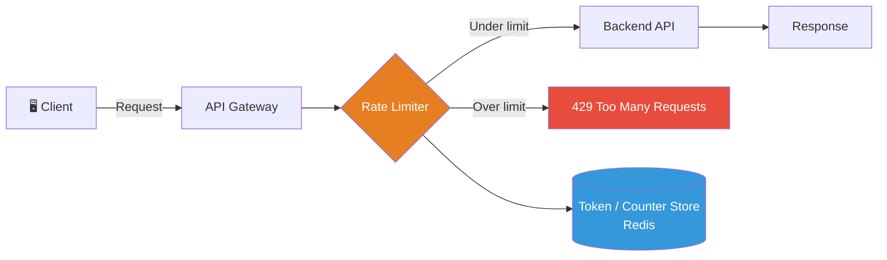

## Overview

API rate limiting controls the number of requests a client can make within a given time window. It protects backend services from overload, prevents abuse, and ensures fair resource distribution across consumers.

## Architecture Diagram



## Core Strategies

### Token Bucket

Each client has a bucket that fills at a fixed rate (e.g. 10 tokens/second, max 100). Each request consumes one token. Requests when the bucket is empty → rejected.

**Best for:** APIs with bursty traffic patterns.

### Fixed Window Counter

Count requests per client within a fixed time window (e.g. 1000 requests/hour). Counter resets at window boundary.

**Best for:** Simple quota enforcement. Caveat: burst attacks at window boundary.

### Sliding Window Log

Track timestamps of all recent requests. Count those within the rolling window.

**Best for:** Precise fairness. Higher memory cost.

### Leaky Bucket

Process requests at a fixed output rate regardless of input rate. Excess requests queue or drop.

**Best for:** Smoothing traffic to downstream services.

## Strategy Comparison

| Strategy | Burst Handling | Memory Cost | Accuracy | Complexity |
|----------|---------------|-------------|----------|------------|
| Token Bucket | ✅ Allows burst | Low | High | Medium |
| Fixed Window | ❌ Boundary burst | Lowest | Medium | Low |
| Sliding Window | ✅ Smooth | High | Highest | High |
| Leaky Bucket | ❌ Queues burst | Low | High | Medium |

## HTTP Response Headers

Standard headers to communicate limits to clients:

```
X-RateLimit-Limit: 1000
X-RateLimit-Remaining: 847
X-RateLimit-Reset: 1708358400
Retry-After: 30
```

Return `429 Too Many Requests` when limit exceeded.

## Conclusion

Token Bucket is the most practical default — it handles burst traffic gracefully while enforcing long-term limits. Use Redis for distributed counter storage across API replicas.
