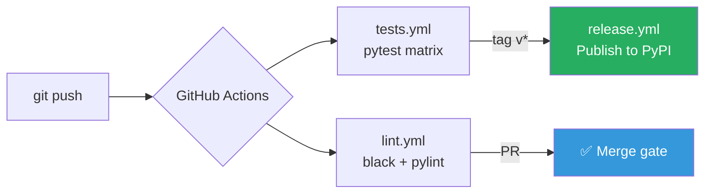

## Purpose

Set up a complete GitHub Actions CI/CD pipeline for a Python project: test on every push, lint on PRs, publish to PyPI on tags.

## Pipeline Overview



## Prerequisites

- GitHub repository
- `requirements.txt` or `pyproject.toml` with dev dependencies
- PyPI account + API token (for release workflow)

## Step 1: Directory Structure

```bash
mkdir -p .github/workflows
```

## Step 2: Test Workflow

`.github/workflows/tests.yml`:

```yaml
name: Tests

on: [push, pull_request]

jobs:
  test:
    runs-on: ubuntu-latest
    strategy:
      matrix:
        python-version: ["3.10", "3.11", "3.12"]

    steps:
      - uses: actions/checkout@v4
      - uses: actions/setup-python@v5
        with:
          python-version: ${{ matrix.python-version }}
      - name: Install dependencies
        run: pip install -r requirements.txt pytest pytest-cov
      - name: Run tests
        run: pytest --tb=short --cov=. --cov-report=term-missing
```

## Step 3: Lint Workflow

`.github/workflows/lint.yml`:

```yaml
name: Lint

on: [push, pull_request]

jobs:
  lint:
    runs-on: ubuntu-latest
    steps:
      - uses: actions/checkout@v4
      - uses: actions/setup-python@v5
        with:
          python-version: "3.12"
      - name: Install linters
        run: pip install black pylint mypy
      - name: Black format check
        run: black --check .
      - name: Pylint
        run: pylint *.py --fail-under=9.0
      - name: Mypy
        run: mypy *.py --ignore-missing-imports
```

## Step 4: Release Workflow

Add PyPI token to GitHub Secrets: `Settings → Secrets → PYPI_API_TOKEN`

`.github/workflows/release.yml`:

```yaml
name: Release

on:
  push:
    tags: ["v*"]

jobs:
  test:
    uses: ./.github/workflows/tests.yml

  publish:
    needs: test
    runs-on: ubuntu-latest
    steps:
      - uses: actions/checkout@v4
      - uses: actions/setup-python@v5
        with:
          python-version: "3.12"
      - name: Build
        run: |
          pip install build
          python -m build
      - name: Publish to PyPI
        uses: pypa/gh-action-pypi-publish@release/v1
        with:
          password: ${{ secrets.PYPI_API_TOKEN }}
```

## Step 5: Trigger a Release

```bash
git tag v1.0.0
git push origin main --tags
# Watch: github.com/your-repo/actions
```

## Conclusion

Three workflows cover the full lifecycle: every push validates quality, every tag ships to PyPI. The matrix strategy ensures compatibility across Python 3.10–3.12 without extra configuration.
